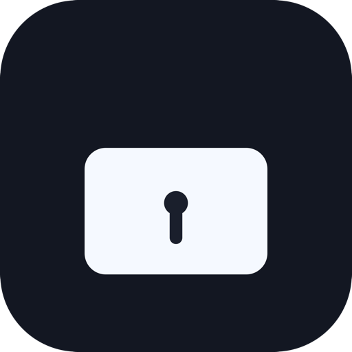

# DOCKR

<p align="center">
  
</p>

Lock the macOS Dock to the display you choose.

## Download

[**Download the latest release**](https://github.com/<GITHUB_OWNER>/DOCKR/releases/latest)

Or install from Terminal:

```bash
git clone https://github.com/<GITHUB_OWNER>/DOCKR.git
cd DOCKR
OWNER=<GITHUB_OWNER> ./scripts/install-latest-release.sh
```

## Updates

- DOCKR checks for stable updates automatically every 15 minutes.
- You can also trigger a check from the menu bar with `Check for Updates...`.
- When an update is available, DOCKR shows `Restart to Update (...)` in the menu.

## First Launch

1. Open `DOCKR`.
2. Grant Accessibility permission when prompted.
3. From the menu bar icon:
   - Enable lock
   - Select target display
   - Use `Relock Now` if needed

## Known macOS Constraint

For side Dock orientation:

- `left` Dock can only be on displays touching the global far-left edge.
- `right` Dock can only be on displays touching the global far-right edge.

DOCKR marks ineligible displays automatically.

## Troubleshooting

If Accessibility permission appears stale:

```bash
tccutil reset Accessibility io.dockr.app
```

Then reopen `/Applications/DOCKR.app` and re-grant permission.

## Maintainers

Release flow and build details are in `docs/MAINTAINER.md`.

## License

MIT
